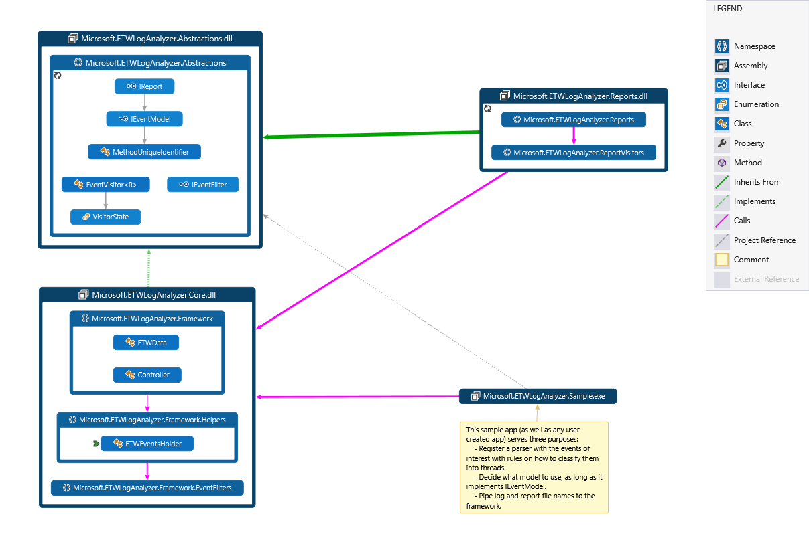
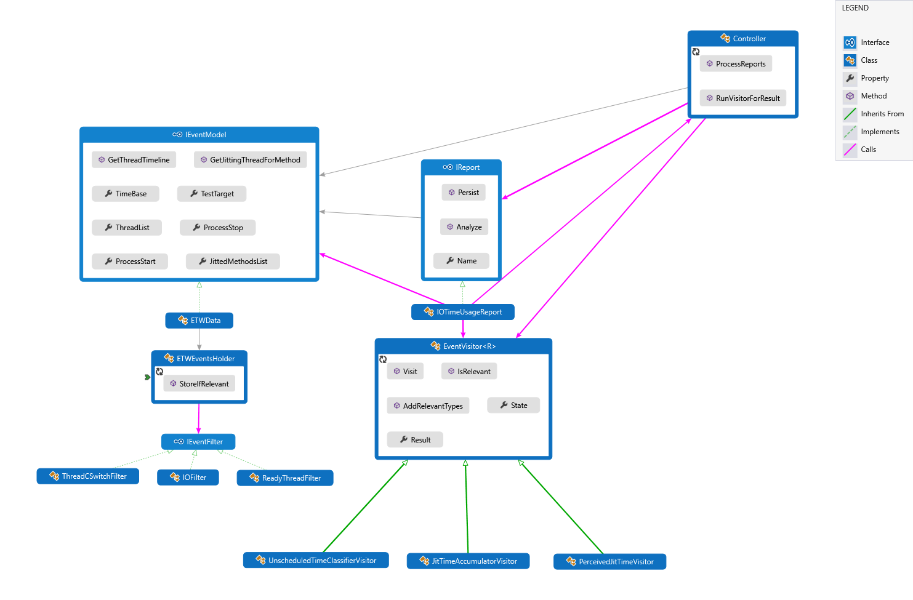
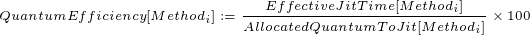
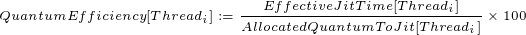

# 1. ETWLogAnalyzer Documentation

<!-- TOC -->

- [1. ETWLogAnalyzer Documentation](#1-etwloganalyzer-documentation)
    - [1.1. Purpose of the tool](#11-purpose-of-the-tool)
    - [1.2. Architecture and Extensibility](#12-architecture-and-extensibility)
        - [1.2.1. Data Storage - the model](#121-data-storage---the-model)
            - [1.2.1.1 ETWData and ETWDataHolder](#1211-etwdata-and-etwdataholder)
        - [1.2.2. The Controller](#122-the-controller)
        - [1.2.3. ReportsVisitors](#123-reportsvisitors)
        - [1.2.4. Reports](#124-reports)
    - [1.3. How to use the tool with the sample app](#13-how-to-use-the-tool-with-the-sample-app)
    - [1.4. Defined Metrics](#14-defined-metrics)
        - [1.4.1. Process Lifespan](#141-process-lifespan)
        - [1.4.2. Thread Lifespan](#142-thread-lifespan)
        - [1.4.3. Time To Program Start (Custom metric for JitBench)](#143-time-to-program-start-custom-metric-for-jitbench)
        - [1.4.4. Time To Server Start (Custom metric for JitBench)](#144-time-to-server-start-custom-metric-for-jitbench)
        - [1.4.5. Time To Request Served (Custom metric for JitBench)](#145-time-to-request-served-custom-metric-for-jitbench)
        - [1.4.6. Nominal Jit Time](#146-nominal-jit-time)
        - [1.4.7. Effective Jit Time](#147-effective-jit-time)
        - [1.4.8. Jit Time Usage Efficiency](#148-jit-time-usage-efficiency)
        - [1.4.9. Quantum time assigned for jit](#149-quantum-time-assigned-for-jit)
        - [1.4.10. Quantum Usage Efficiency](#1410-quantum-usage-efficiency)
    - [1.5. Existing reports and understanding their significance](#15-existing-reports-and-understanding-their-significance)
    - [1.6. Relevant documentation for TraceEvents when generating your own reports](#16-relevant-documentation-for-traceevents-when-generating-your-own-reports)

<!-- /TOC -->

## 1.1. Purpose of the tool

ETWLogAnalyzer is a framework that simplifies the analysis of performance changes in the JIT compiler based on ETW logs.

## 1.2. Architecture and Extensibility

The framework can be divided into three parts:

- The essential part of the framework lives in the assemblies `Microsoft.ETWLogAnalyzer.Abstractions` and `Microsoft.ETWLogAnalyzer.Framework`. It contains the interfaces and components that will generate the reports and defines the surface area through which reports can request information.
- Some reports of interest can be found in the `Microsoft.ETWLogAnalyzer.Reports` assembly. Reports represent the bulk 
- The user might have to implement a driver, which has the responsibility of building the model and then kicking off the analysis and report generation using the [Controller](#122-The-Controller). Building the model normally depends a lot on the type of analysis that needs to be done, however a working sample of such driver logic that covers most usage scenarios can be found in `Microsoft.EtwLogAnalyzer.Sample`. It currently facilitates command line argument parsing as well as building a model and generating the reports by as long as they only depend on the following type of events: Thread Start, Thread Stop, Context Switch, Ready Threads (ready to get scheduled), Disk reads, Module Loads, Hard memory faults, Jitting Started, Load Verbose (Jitting Ended), and custom provider events.

The idea is users will only need to write reports and visitors, and let the framework do the heavy lifting work. The reports will consume the data model through visitors and use the results to persist them. The main flow can be visualized as such:

### 1.2.1. Data Storage - the model

It all starts with building the model. All models used to store the data gathered from the ETW log must implement the [IEventModel](..\ETWLogAnalyzer\Microsoft.ETWLogAnalyzer.Abstractions\Abstractions\Model\IEventModel.cs) interface. The model surfaces API's that allow to query:

- Information for the target process (pid, start and stop events, etc.).
- List of jitted methods and threads used.
- An iterator (IEnumerator) for events that happened on a given thread, ordered chronologically.

#### 1.2.1.1 ETWData and ETWDataHolder
A concrete example of the model implemented at the framework level is [ETWData](..\ETWLogAnalyzer\Microsoft.ETWLogAnalyzer.Core\ETWData\ETWData.cs). It surfaces the basic API's of the interface, and there are plans to support serialization and deserialization of `ETWData` in the near future. To be constructed it needs a `ETWDataHolder` instance and the start and stop events for the process. To see how to obtain these see the [main driver](..\ETWLogAnalyzer\Microsoft.ETWLogAnalyzer.Sample\Program.cs) in `Microsoft.EtwLogAnalyzer.Sample`.

The main role of the [ETWDataHolder](..\ETWLogAnalyzer\Microsoft.ETWLogAnalyzer.Core\ETWData\ETWHelpers.cs) is filter the events that are relevant relevant for the analysis and cache them to build the `ETWData` instance. For this, it surfaces the API call `StoreIfRelevant` that takes an event and an optional [IEventFilter](..\ETWLogAnalyzer\Microsoft.ETWLogAnalyzer.Abstractions\Abstractions\Filters\IEventFilter.cs). The `ETWDataHolder` instance will then use the filter to determine if the event is relevant to the process (the return value of the filter's operation), and the thread(s) that the event impacts (the filter's operation's out parameter). By default the filter used will be the one passed into the call, followed by some standard filters registered, and then it will use a filter that just uses the thread ID in the event to classify it into the corresponding thread. The default filter covers most situations, but say context switches might impact two threads, or `ReadyThread` events really affect the awakened thread and not the thread that sends the event; these two cases are covered in the custom filters. To see the custom registered filters see the constructor of `ETWDataHolder`. 

### 1.2.2. The Controller

The [controller](..\ETWLogAnalyzer\Microsoft.ETWLogAnalyzer.Core\Controller\Controller.cs) is the component of the framework that manages who has access to the data model and how they can access it as follows:

- `RunVisitorForResult` - Reports will have to use a visitor to analyze the data provided by the model. This method will take the visitor and an iterator to the stream of events that need to be analyzed and run it for the result. It also uses the state of the result to exit if the result was found or if the visitor reported an error state on the data.
- `ProcessReports` - Given the folder of the assemblies where the reports are and the data to analyze, the controller will load them dynamically and generate them leaving the reports and a run log on the specified folder.
- Serialization/Deserialization of `ETWData` instances will be supported in the future.

### 1.2.3. ReportsVisitors

_Report visitors_ are the basic blocks that reports will use to perform analysis on the data. The convenient part is they are small objects of their own that can store state that's usually needed for event series analysis (e.g a specific type of event sequence that seems to be a performance bottleneck). This might have to happen at the cost of multiple passes, but adds to the extensibility of the analysis tool which is our main goal.

All visitors extend the generic class [EventVisitorBase](..\ETWLogAnalyzer\Microsoft.ETWLogAnalyzer.Abstractions\Abstractions\ReportVisitors\EventVisitorBase.cs), with the generic parameter being the type of result expected from the calculation. Within the base class:

- `State` is a property that should be updated to `VisitorState.Error` if any problem is encountered and the report should handle accordingly, or set to `VisitorState.Done` so the controller can escape early from the iterating through the events.
- `Visit` should implement the logic of the analysis
- `AddRelevantTypes` - Most events that will be found might not be relevant for a type of analysis. The controller will use the types added to restrict the events that use the `Visit` method only to the types added as relevant.
- `IsRelevant` - Method the controller uses to determine if an event is relevant before visiting it. Doesn't need to be overridden if the filtering is performed using the filtering by type as described in `AddRelevantTypes`, otherwise must be implemented.
- `Result` is a property of the type of the generic parameter of the visitor and caches the result of the calculation. It's only valid if `State` is not `VisitorState.Error`

An example of this is [PerceivedJitTimeVisitor](..\ETWLogAnalyzer\Microsoft.ETWLogAnalyzer.Reports\ReportVisitors\PerceivedJitTimeVisitor.cs).

### 1.2.4. Reports

All reports generated by the framework implement the [IReport](..\ETWLogAnalyzer\Microsoft.ETWLogAnalyzer.Abstractions\Abstractions\Reports\IReport.cs) interface. All it provides is the name of the report and two stub methods:

- `Analyze` is the method where reports should create visitors to the data model that's passed in and cache the results in any convenient format.
- `Persist` is the method where the cached analyzed data should be persisted in whatever manner the developer feels meets their purpose.

## 1.3. How to use the tool with the sample app

To run the sample app open an Visual Studio developer console with Admin privileges and navigate to the [scripts](../Scripts/) folder.

- First you need to run the [data collection script](../Scripts/collect_etw_data.cmd). This will compile the JitBench app using a freshly downloaded version .NET core and collect the ETW log. There isn't any need to modify the script unless you want to modify what events get collected or versions off the framework. The script also supports the following flags.
  - `SkipInstall` - By default the scripts will download the SDK and shared framework. However this might be slow and if you modified the . To modify the runtime just place the changed DLL's in `.dotnet/shared/Microsoft.NETCore.App/2.1.0-preview2-25523-01` and run with this flag again.
  - `KeepCache` - By default the script will clear the NuGet cache. Pipe this if you prefer not to empty it. 
  - `DisableSuperfetch` - Use this flag to ensure a cold start. The script must be run with elevated access. 
- Second run the [data analysis script](../Scripts/analyze_etw_data.cmd). You should modify the `OUT_DIR` variable script to point to the folder you want to store the reports to. You can modify the `WAIT` variable to false if you don't want the tool to wait for user input at the end as well.

## 1.4. Defined Metrics

### 1.4.1. Process Lifespan

The lifespan of a process is the time between the `Windows Kernel\Process\Start` and `Windows Kernel\Process\Stop` events.

### 1.4.2. Thread Lifespan

The lifespan of a thread is the time between the `Windows Kernel\Thread\Start` and `Windows Kernel\Thread\Stop` events.

]

### 1.4.3. Time To Program Start (Custom metric for JitBench)

The _time to program start_ is the time between the `Windows Kernel\Process\Start` and `aspnet-JitBench-MusicStore/ProgramStarted` events.

### 1.4.4. Time To Server Start (Custom metric for JitBench)

The _time to program start_ is the time between the `Windows Kernel\Process\Start` and `aspnet-JitBench-MusicStore/ServerStarted` events.

### 1.4.5. Time To Request Served (Custom metric for JitBench)

The _time to program start_ is the time between the `Windows Kernel\Process\Start` and the first `aspnet-JitBench-MusicStore/RequestBatchServed` events.

### 1.4.6. Nominal Jit Time

The _nominal jit time_ of a method is the time between its `JittingStarted` and `Method/LoadVerbose`events.

The _nominal jit time_ of a thread is the sum of the nominal jit times of the methods jitted in the thread.

### 1.4.7. Effective Jit Time

The _effective jit time_ of a method is the time between its `Microsoft-Windows-DotNETRuntime/Method/JittingStarted` and `Method/LoadVerbose` events excluding the intervals where the jitting thread is switched out. For example if there is `N` context switch pairs between the `JittingStarted` and `LoadVerbose` then the effective time can be defined as:

It's worth noting that if there are no context switches, the effective and nominal times are equivalent.

The _effective jit time_ of a thread is the sum of the effective jit times of the methods jitted in the thread.

### 1.4.8. Jit Time Usage Efficiency

The _JIT time usage efficiency_ for a method is the quotient between its [Effective Jit Time](#147-effective-jit-time) and [Nominal Jit Time](#146-nominal-jit-time) multiplied by a hundred.

The _JIT time usage efficiency_ for a thread is the quotient [Effective Jit Time](#147-effective-jit-time) and the [Nominal Jit Time](#146-nominal-jit-time) for the thread multiplied by a hundred.

### 1.4.9. Quantum time assigned for jit

The _Quantum time assigned for jit_ for a method is the amount of time used to jit excluding the time the thread was scheduled out plus the amount of time remaining in the quantum allocated by the scheduler the JIT could've used but was scheduled out for some blocking operation (i.e. I/O)

The _Quantum time assigned for jit_ for a thread is method is the sum of the Quantum time assigned for jitting of the methods jitted in the thread.

### 1.4.10. Quantum Usage Efficiency

The _Quantum Usage Efficiency_ for a method is the quotient between its [Effective Jit Time](#147-effective-jit-time) and [Quantum time assigned for jit](#149-quantum-time-assigned-for-jit) multiplied by a hundred.

The _JIT time usage efficiency_ for a thread is the quotient [Effective Jit Time](#147-effective-jit-time) and the [Quantum time assigned for jit](#149-quantum-time-assigned-for-jit) for the thread multiplied by a hundred.

## 1.5. Existing reports and understanding their significance

- `LifetimeReport`: This report contains the process and thread lifetime information as well as the JitBench specific statistics described in the [metrics](#14-defined-metrics) section.
- `JitTimeReport`: This report contains all the _nominal_ and _effective_ jit times as well as the _jit time efficiency_ per thread and method.
- `QuantumUsageReport`: This report contains a per thread and per method breakdown of the _effective_ time used to jit as well as how much time was requested for this task (see [Available Time to Jit](#149-quantum-time-assigned-for-jit)) and their quotient (i.e. the Quantum Usage Efficiency).
- `IOTimeUsageReport`: This report displays how time is split across jitting, I/O, idle, and other preemptive operations. 
- `LoadedModules`: This report contains a list of the modules loaded by the jitting of each individual method. 

## 1.6. Relevant documentation for TraceEvents when generating your own reports

The documents and release notes can be found in the [TraceEvent documentation](TraceEventDocs/) folder